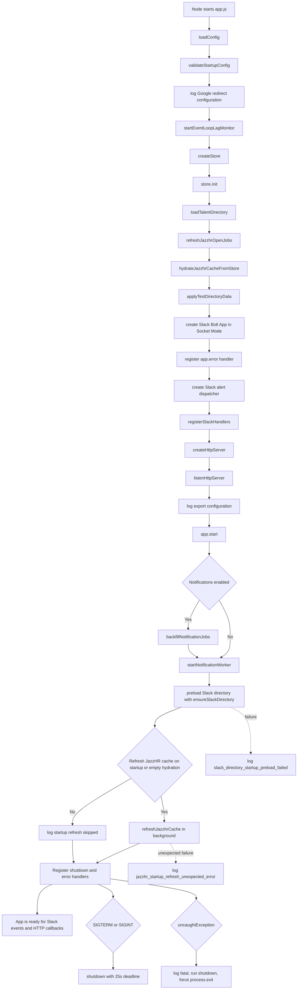
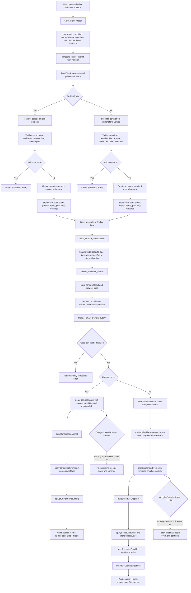
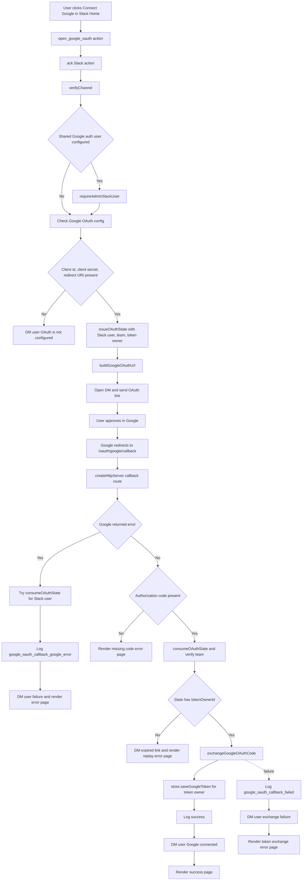

# App Flowcharts

These diagrams map the main runtime paths for startup, Slack intake scheduling, and Google connection.

## App Startup

```mermaid
flowchart TD
  A[Node starts app.js] --> B[loadConfig]
  B --> C[validateStartupConfig]
  C --> D[log Google redirect configuration]
  D --> E[startEventLoopLagMonitor]
  E --> F[createStore]
  F --> G[store.init]
  G --> H[loadTalentDirectory]
  H --> I[refreshJazzhrOpenJobs]
  I --> J[hydrateJazzhrCacheFromStore]
  J --> K[applyTestDirectoryData]
  K --> L[create Slack Bolt App in Socket Mode]
  L --> M[register app.error handler]
  M --> N[create Slack alert dispatcher]
  N --> O[registerSlackHandlers]
  O --> P[createHttpServer]
  P --> Q[listenHttpServer]
  Q --> R[log export configuration]
  R --> S[app.start]
  S --> T{Notifications enabled}
  T -- Yes --> U[backfillNotificationJobs]
  T -- No --> V[startNotificationWorker]
  U --> V
  V --> W[preload Slack directory with ensureSlackDirectory]
  W --> X{Refresh JazzHR cache on startup or empty hydration}
  X -- Yes --> Y[refreshJazzhrCache in background]
  X -- No --> Z[log startup refresh skipped]
  Y --> AA[Register shutdown and error handlers]
  Z --> AA
  AA --> AB[App is ready for Slack events and HTTP callbacks]

  W -. failure .-> W1[log slack_directory_startup_preload_failed]
  Y -. unexpected failure .-> Y1[log jazzhr_startup_refresh_unexpected_error]
  AA --> AC{SIGTERM or SIGINT}
  AC --> AD[shutdown with 25s deadline]
  AA --> AE{uncaughtException}
  AE --> AF[log fatal, run shutdown, force process.exit]
```

## Intake Form To Calendar Invite

```mermaid
flowchart TD
  A[User opens schedule workflow in Slack] --> B[Slack intake modal]
  B --> C[User selects event type, role, candidate, recruiters, HM, resume, Zoom, timezone]
  C --> D[schedule_intake_submit view handler]
  D --> E[Read Slack view state and private metadata]
  E --> F{Custom Invite}

  F -- Yes --> G[Resolve selected Slack recipients]
  G --> H[Validate custom title, recipients, subject, body, meeting link]
  H --> I{Validation errors}
  I -- Yes --> I1[Return Slack field errors]
  I -- No --> J[Create or update generic custom invite case]
  J --> K[Store case, audit event, publish Home, post case message]
  K --> L[Open schedule or finalize flow]

  F -- No --> M[buildIntakeDraft from current form values]
  M --> N[Validate applicant, recruiter, HM, resume, Zoom, template, timezone]
  N --> O{Validation errors}
  O -- Yes --> O1[Return Slack field errors]
  O -- No --> P[Create or update standard scheduling case]
  P --> Q[Store case, audit event, publish Home, post case message]
  Q --> L

  L --> R[open_finalize_modal action]
  R --> S[finalizeModal collects date, time, attendees, Zoom, stage, duration]
  S --> T[finalize_schedule_submit]
  T --> U[Build scheduleInput and preview case]
  U --> V[Render candidate or custom invite email preview]
  V --> W[finalize_email_preview_submit]
  W --> X{Case can still be finalized}
  X -- No --> X1[Return already scheduled error]
  X -- Yes --> Y{Custom Invite}

  Y -- Yes --> Z[createCalendarEvent with custom event title and meeting link]
  Z --> ZA[buildScheduleSnapshot]
  ZA --> ZB[applyScheduledEvent and store.updateCase]
  ZB --> ZC[deliverCustomInviteEmails]
  ZC --> ZD[Audit, publish Home, update case Slack thread]

  Y -- No --> AA[Build final candidate email from preview edits]
  AA --> AB[addRequiredResumeAttachment when stage requires resume]
  AB --> AC[createCalendarEvent with rendered email description]
  AC --> AD[buildScheduleSnapshot]
  AD --> AE[applyScheduledEvent and store.updateCase]
  AE --> AF[sendRecruiterEmail for candidate invite]
  AF --> AG[scheduleCaseNotifications]
  AG --> AH[Audit, publish Home, update case Slack thread]

  Z --> Z1{Google Calendar insert conflict}
  Z1 -- Existing deterministic event id --> Z2[Fetch existing Google event and continue]
  AC --> AC1{Google Calendar insert conflict}
  AC1 -- Existing deterministic event id --> AC2[Fetch existing Google event and continue]
```

## Google Connection

```mermaid
flowchart TD
  A[User clicks Connect Google in Slack Home] --> B[open_google_oauth action]
  B --> C[ack Slack action]
  C --> D[verifyChannel]
  D --> E{Shared Google auth user configured}
  E -- Yes --> F[requireAdminSlackUser]
  E -- No --> G[Check Google OAuth config]
  F --> G
  G --> H{Client id, client secret, redirect URI present}
  H -- No --> H1[DM user OAuth is not configured]
  H -- Yes --> I[issueOAuthState with Slack user, team, token owner]
  I --> J[buildGoogleOAuthUrl]
  J --> K[Open DM and send OAuth link]
  K --> L[User approves in Google]
  L --> M[Google redirects to /oauth/google/callback]

  M --> N[createHttpServer callback route]
  N --> O{Google returned error}
  O -- Yes --> P[Try consumeOAuthState for Slack user]
  P --> Q[Log google_oauth_callback_google_error]
  Q --> R[DM user failure and render error page]

  O -- No --> S{Authorization code present}
  S -- No --> S1[Render missing code error page]
  S -- Yes --> T[consumeOAuthState and verify team]
  T --> U{State has tokenOwnerId}
  U -- No --> U1[DM expired link and render replay error page]
  U -- Yes --> V[exchangeGoogleOAuthCode]
  V --> W[store.saveGoogleToken for token owner]
  W --> X[Log success]
  X --> Y[DM user Google connected]
  Y --> Z[Render success page]

  V -. failure .-> V1[Log google_oauth_callback_failed]
  V1 --> V2[DM user exchange failure]
  V2 --> V3[Render token exchange error page]
```
