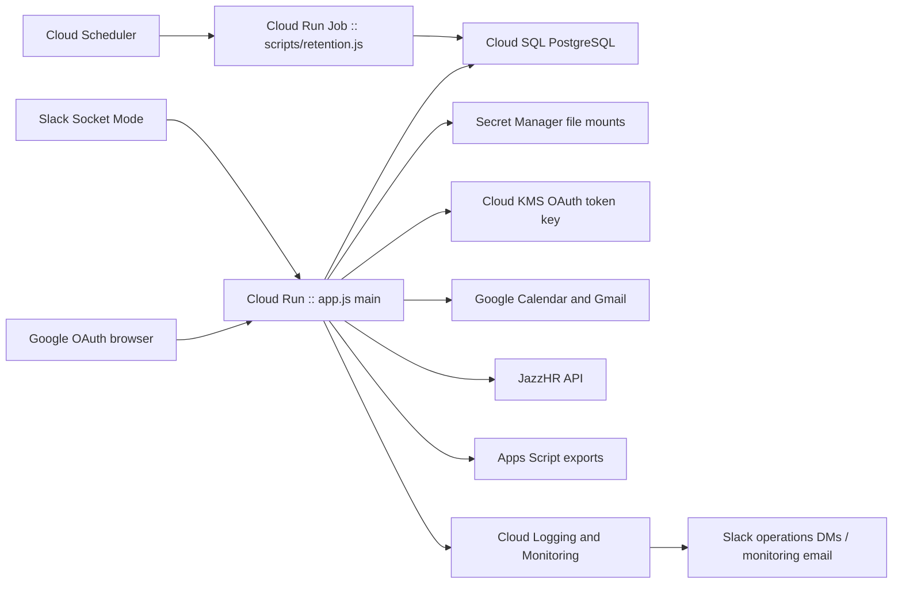
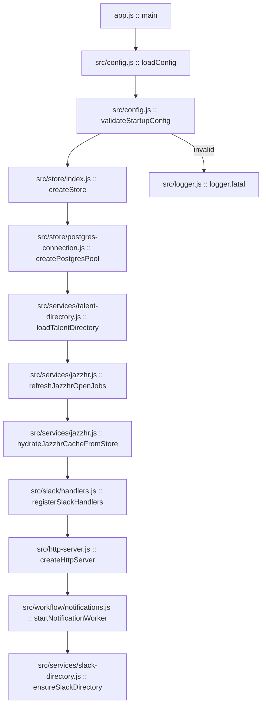
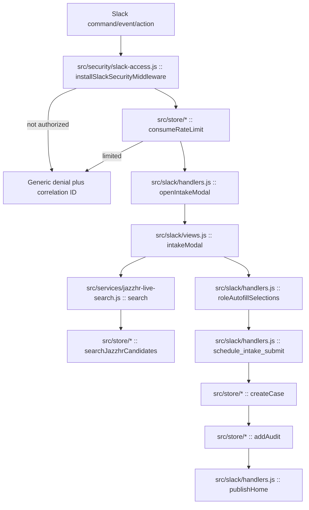
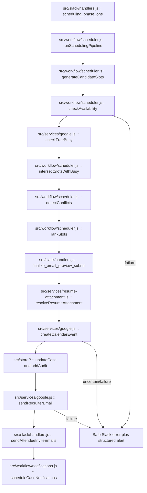
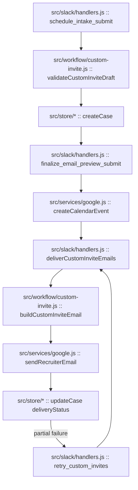
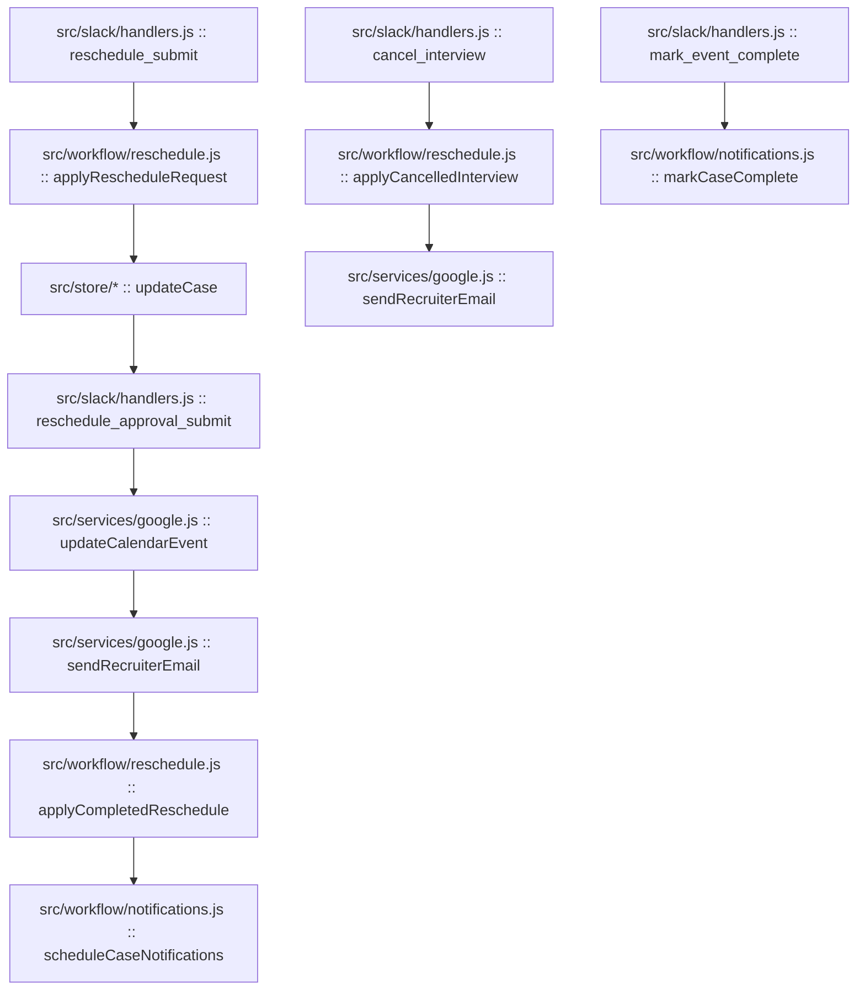
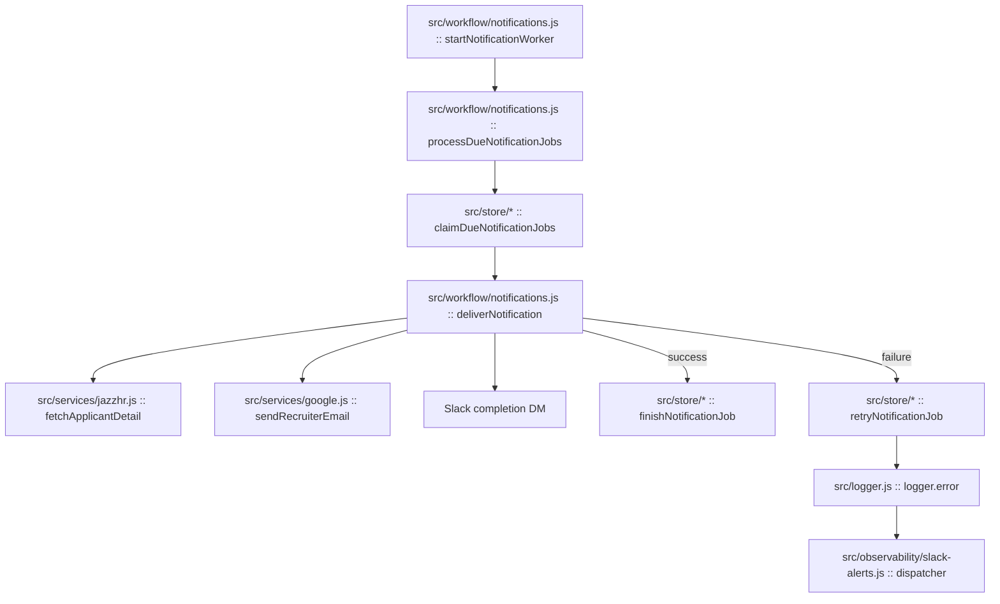
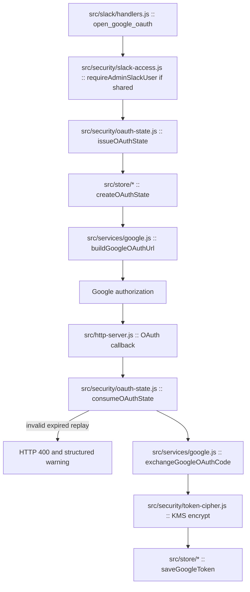
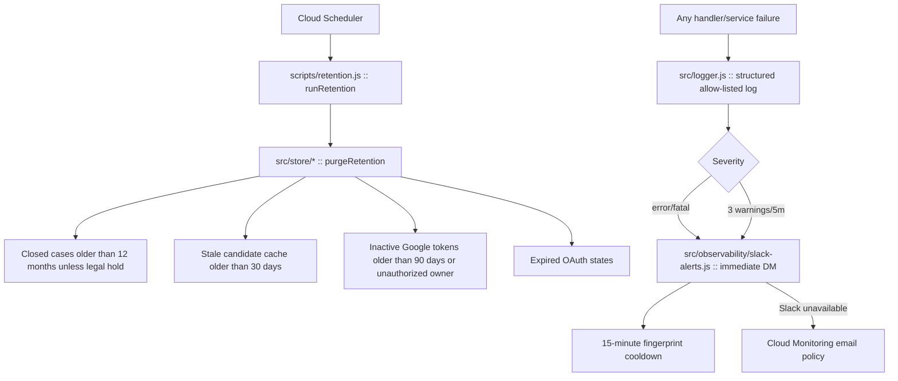

# Process Flows

Nodes use `path :: function()` notation.

## GCP architecture

## Startup

## Slack intake and search

## Scheduling and finalization

## Custom Invite

## Reschedule, cancel, and complete

## Notifications

## Google OAuth

## Retention and errors

## Trigger matrix

| Trigger | Entry handler | Primary downstream work | Persistent/external effects |
|---|---|---|---|
| `/schedule-interview` | `src/slack/handlers.js :: command` | `openIntakeModal` | Slack modal/message |
| `/slack-scheduler` | `src/slack/handlers.js :: command` | cache/directory refresh | JazzHR/Apps Script reads |
| App Home | `app_home_opened` | `publishHome` | PostgreSQL reads, Slack Home publish |
| Intake actions/options | action/options handlers | search, role mapping, modal refresh | JazzHR reads, Slack updates |
| `schedule_intake_submit` | view handler | `createCase`, `addAudit` | PostgreSQL writes |
| Scheduling phase one | view handler | `runSchedulingPipeline` | Google free/busy, PostgreSQL writes |
| Scheduling/finalize submit | view handlers | Calendar, email, notifications | Google Calendar/Gmail, PostgreSQL |
| Reschedule/cancel/complete | action/view handlers | state transitions and notifications | Calendar/Gmail/Slack/PostgreSQL |
| Notification tick | `processDueNotificationJobs` | claim/deliver/retry | PostgreSQL/JazzHR/Gmail/Slack |
| `/oauth/google/callback` | HTTP server | state consumption/token exchange | Google OAuth, KMS, PostgreSQL |
| Daily retention | Cloud Run Job | `purgeRetention` | PostgreSQL deletes |
