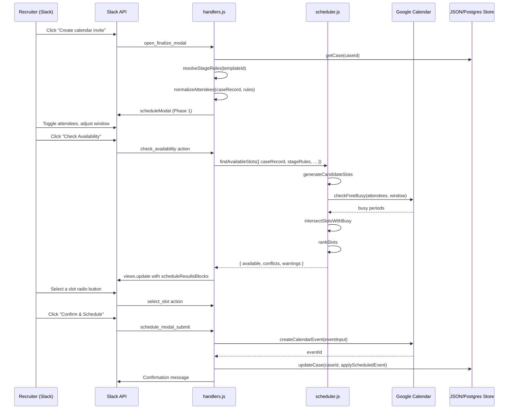

# Centralized Interview Scheduling Architecture

> Blueprint for Phases 3–6 of the Slack-first interview scheduling assistant  
> Based on audit of codebase as of 2026-05-17

---

## Table of Contents

1. [Interview Stage Configuration System](#1-interview-stage-configuration-system)
2. [Attendee Management Model](#2-attendee-management-model)
3. [Scheduling Engine](#3-scheduling-engine-srcworkflowschedulerjs)
4. [Conflict Detection Algorithm](#4-conflict-detection-algorithm)
5. [Availability/Scheduling UI Flow](#5-availabilityscheduling-ui-flow-slack-block-kit)
6. [Database Extensions](#6-database-extensions)
7. [New Module Map](#7-new-module-map)
8. [Flexibility & Extensibility](#8-flexibility--extensibility)

---

## 1. Interview Stage Configuration System

### 1.1 Design Rationale

The existing codebase has three implicit "stages" surfaced only through [`TEMPLATE_METADATA`](src/templates.js:15) (which maps template IDs to `interviewStage` and `resumeRequired`). A dedicated stage-rules configuration decouples interview rules from email templates and makes them extensible without code changes.

### 1.2 Configuration Structure

```js
// New file: src/stage-rules.js

const DEFAULT_STAGE_RULES = {
  '1st-interview': {
    label: '1st Interview',
    hiringManagerRequired: false,
    hiringManagerDefault: 'excluded',   // 'excluded' | 'optional' | 'included'
    typicalDurationMinutes: 30,
    maxDurationMinutes: 60,
    bufferMinutes: 15,                  // gap before/after
    maxInterviewers: 2,                 // panel size cap (excluding recruiter)
    allowExternalInterviewers: false,
    description: 'Initial screening call with recruiter',
  },

  '2nd-or-final': {
    label: '2nd/Final Interview',
    hiringManagerRequired: true,
    hiringManagerDefault: 'included',
    typicalDurationMinutes: 45,
    maxDurationMinutes: 90,
    bufferMinutes: 30,
    maxInterviewers: 4,
    allowExternalInterviewers: true,
    description: 'Technical/team interview with hiring manager',
  },

  'final-offer': {
    label: 'Final Offer Discussion',
    hiringManagerRequired: false,
    hiringManagerDefault: 'optional',
    typicalDurationMinutes: 30,
    maxDurationMinutes: 45,
    bufferMinutes: 15,
    maxInterviewers: 2,
    allowExternalInterviewers: false,
    description: 'Offer discussion with recruiter, optional HM',
  },
}

// Template-to-stage mapping (extends existing TEMPLATE_METADATA)
const TEMPLATE_STAGE_MAP = {
  '1st-interview-invite': '1st-interview',
  '2nd-or-Final-invite': '2nd-or-final',
  'Thank You Email - 2nd-or-Final Interview': '2nd-or-final',
  'interview-reminder': null,          // reminders are stage-agnostic
  'interview-reminder (unresponsive candidate)': null,
}
```

### 1.3 Resolution Logic

```js
// src/workflow/attendees.js — resolveStageRules()

export function resolveStageRules(templateId, overrides = {}) {
  const stageKey = TEMPLATE_STAGE_MAP[templateId] || '1st-interview'
  const base = structuredClone(DEFAULT_STAGE_RULES[stageKey])

  // Per-recruiter or per-case overrides
  if (overrides.hiringManagerRequired !== undefined) base.hiringManagerRequired = overrides.hiringManagerRequired
  if (overrides.hiringManagerDefault !== undefined) base.hiringManagerDefault = overrides.hiringManagerDefault
  if (overrides.durationMinutes) base.typicalDurationMinutes = overrides.durationMinutes
  if (overrides.bufferMinutes !== undefined) base.bufferMinutes = overrides.bufferMinutes
  if (overrides.maxInterviewers !== undefined) base.maxInterviewers = overrides.maxInterviewers

  return base
}
```

### 1.4 Where Overrides Are Stored

Overrides are stored on the case record (see [§6 Database Extensions](#6-database-extensions)), allowing per-case customization without touching the global defaults.

```js
// On case record:
{
  stageOverrides: {
    durationMinutes: 60,
    hiringManagerDefault: 'included',
  }
}
```

### 1.5 Extensibility

To add a new interview stage (e.g., `panel-interview`):

1. Add an entry to `DEFAULT_STAGE_RULES` in [`src/stage-rules.js`](src/stage-rules.js)
2. Add a mapping in `TEMPLATE_STAGE_MAP` if a new email template accompanies it
3. No database migration needed — stage rules are in-memory config, not DB rows

---

## 2. Attendee Management Model

### 2.1 The Attendee Type

```js
// Each attendee:
{
  id: string,              // 'person-{uuid}' or same as source person id
  name: string,            // 'Ana Cruz'
  email: string,           // 'ana.cruz@example.com'
  role: string,            // 'hiring_manager' | 'recruiter' | 'interviewer' | 'external'
  required: boolean,       // true if this person must be present
  included: boolean,       // true if this person should be invited (user-togglable)
  slackUserId: string|null, // null for external attendees
  source: string,          // 'case' (from case record) | 'manual' (added in modal) | 'external'
  positionTitle: string|null,
}
```

### 2.2 Case Model Extensions

The existing `hiringManager` field (singular) is preserved for backward compatibility but is supplemented by a plural `attendees` list.

```js
// Existing field preserved (backward compatible):
hiringManager: { id, name, email, role, slackUserId, positionTitle }

// NEW fields on case:
attendees: Attendee[],          // full resolved attendee list
stageKey: string,               // '1st-interview' | '2nd-or-final' | 'final-offer'
stageOverrides: {},             // per-case stage rule overrides (see §1.4)
```

### 2.3 Attendee Normalization

`src/workflow/attendees.js` normalizes attendees from the case record and stage rules:

```js
export function normalizeAttendees(caseRecord, stageRules) {
  const attendees = []

  // 1. Applicant is always included and required
  attendees.push({
    id: caseRecord.applicant?.id || `person-${crypto.randomUUID()}`,
    name: [caseRecord.applicant?.firstName, caseRecord.applicant?.lastName].filter(Boolean).join(' '),
    email: caseRecord.applicant?.email,
    role: 'candidate',
    required: true,
    included: true,
    slackUserId: null,
    source: 'case',
    positionTitle: null,
  })

  // 2. Recruiter is always included and required
  attendees.push({
    id: caseRecord.recruiter?.id || `person-${crypto.randomUUID()}`,
    name: caseRecord.recruiter?.name,
    email: caseRecord.recruiter?.email,
    role: 'recruiter',
    required: true,
    included: true,
    slackUserId: caseRecord.recruiter?.slackUserId || null,
    source: 'case',
    positionTitle: null,
  })

  // 3. Hiring Manager — inclusion governed by stage rules
  const hmDefault = stageRules.hiringManagerDefault
  const hmIncluded = hmDefault === 'included' || (hmDefault === 'optional' && caseRecord.attendeeOverrides?.hiringManagerIncluded)
  attendees.push({
    id: caseRecord.hiringManager?.id || `person-${crypto.randomUUID()}`,
    name: caseRecord.hiringManager?.name,
    email: caseRecord.hiringManager?.email,
    role: 'hiring_manager',
    required: stageRules.hiringManagerRequired,
    included: hmIncluded,
    slackUserId: caseRecord.hiringManager?.slackUserId || null,
    source: 'case',
    positionTitle: caseRecord.hiringManager?.positionTitle || null,
  })

  // 4. Additional panel interviewers from existing guests array
  for (const guest of (caseRecord.guests || [])) {
    attendees.push({
      id: `guest-${crypto.randomUUID()}`,
      name: guest.name || guest.email,
      email: guest.email,
      role: 'interviewer',
      required: false,
      included: true,
      slackUserId: guest.slackUserId || null,
      source: 'manual',
      positionTitle: null,
    })
  }

  // 5. External attendees (email-only, added in modal)
  for (const ext of (caseRecord.externalAttendees || [])) {
    attendees.push({
      id: `ext-${crypto.randomUUID()}`,
      name: ext.name || ext.email,
      email: ext.email,
      role: 'external',
      required: ext.required || false,
      included: true,
      slackUserId: null,
      source: 'external',
      positionTitle: null,
    })
  }

  return attendees
}
```

### 2.4 Multiple HMs / Panel Support

The single `hiringManager` field on cases is limited to one person. Panel support is achieved through:

1. **The `guests` array** (already exists, currently used for internal guest multi-select in the finalize modal) — extended so each guest has `{ id, name, email, role, slackUserId }` instead of just email strings.
2. **The `externalAttendees` array** (new) — for email-only interviewers not in the sample data.

This avoids creating a separate "panel" concept — the attendee list is the single source of truth.

---

## 3. Scheduling Engine (`src/workflow/scheduler.js`)

### 3.1 Architecture Overview

```
┌─────────────────────────────────────────────────────────────────────┐
│                     Scheduling Engine Pipeline                       │
│                                                                     │
│  Input:                                                             │
│  ├── windowStart, windowEnd (from case.interviewWindowStart/End)    │
│  ├── timeZone (from case.interviewTimezone)                         │
│  ├── durationMinutes (from stage rules)                             │
│  ├── bufferMinutes (from stage rules)                               │
│  ├── includedAttendees (from normalizeAttendees, included=true)     │
│  └── existingEvents (from Google Calendar freeBusy)                 │
│                                                                     │
│  Step 1 ──► generateCandidateSlots()                                │
│  Step 2 ──► call checkFreeBusy() for all included attendees         │
│  Step 3 ──► intersectSlotsWithBusy()                                │
│  Step 4 ──► rankSlots()                                             │
│  Step 5 ──► detectConflicts() for each slot                         │
│                                                                     │
│  Output: { available: Slot[], conflicts: Conflict[], warnings[] }   │
└─────────────────────────────────────────────────────────────────────┘
```

### 3.2 Slot Type Definition

```js
// Slot: a specific time window proposed for the interview
{
  start: ISO string,              // '2026-05-20T01:00:00.000Z' (UTC)
  end: ISO string,                // '2026-05-20T01:30:00.000Z' (UTC)
  localStart: string,             // '2026-05-20 09:00' (in interview timezone)
  localEnd: string,               // '2026-05-20 09:30'
  score: number,                  // 0.0–1.0, higher = better
  allAvailable: boolean,          // true if zero attendees have conflicts
  conflicts: {                    // keyed by attendee email
    'ana@example.com': {
      hasConflict: boolean,
      overlappingEvents: [
        { summary: string, start: ISO, end: ISO }
      ]
    }
  },
  bufferStatus: {
    beforeClear: boolean,         // true if buffer before slot is clear
    afterClear: boolean,          // true if buffer after slot is clear
    beforeMinutes: number,        // actual gap before (0 if no adjacent event)
    afterMinutes: number,
  },
  warnings: string[],             // human-readable warning messages
}
```

### 3.3 Step 1: `generateCandidateSlots()`

Generates all possible time slots within the date window, during business hours, excluding weekends.

```js
export function generateCandidateSlots({
  windowStart,       // '2026-05-18'
  windowEnd,         // '2026-05-22'
  timeZone,          // 'Australia/Sydney'
  durationMinutes,   // 30
  businessDayStart,  // '09:00'
  businessDayEnd,    // '18:00'
}) {
  const slots = []
  const zone = timeZone || 'Australia/Sydney'

  // Iterate each calendar day in the window
  let cursor = parseDateToLocalMidnight(windowStart, zone)
  const endDate = parseDateToLocalMidnight(windowEnd, zone)

  while (cursor <= endDate) {
    const dayOfWeek = getDayOfWeek(cursor, zone)
    const isWeekend = dayOfWeek === 0 || dayOfWeek === 6

    if (!isWeekend) {
      // Generate 30-min blocks from 09:00 to (18:00 - duration)
      const daySlots = generateDaySlots(cursor, durationMinutes, businessDayStart, businessDayEnd, zone)
      slots.push(...daySlots)
    }

    cursor = addDays(cursor, 1)
  }

  return slots
}
```

**Key design decisions:**
- Weekends (Sat/Sun) are excluded by default; configurable via `stageRules.allowWeekends`.
- Slots are generated in the interview's timezone, not UTC.
- Slot granularity is 30 minutes (configurable).
- The last slot ends at `businessDayEnd` minus `durationMinutes` (e.g., a 45-min interview can start no later than 17:15).

### 3.4 Step 2: `call checkFreeBusy()`

Wire the existing (dead) `checkFreeBusy()` in [`src/services/google.js`](src/services/google.js:53) into the scheduling workflow.

```js
export async function checkAttendeeAvailability({
  config,
  logger,
  store,
  recruiterId,
  attendees,       // Attendee[] — only included attendees
  windows,         // [{ timeMin: ISO, timeMax: ISO }] — one per day in range
}) {
  // Build email list from included attendees (excluding candidate)
  const calendarAttendees = attendees
    .filter(a => a.role !== 'candidate' && a.included)
    .map(a => a.email)

  // Call existing Google freeBusy API
  const freeBusyResult = await checkFreeBusy({
    config,
    logger,
    attendees: calendarAttendees,
    windows,
    store,
    recruiterId,
  })

  if (freeBusyResult.mocked) {
    logger.warn('scheduler_availability_mocked', {
      attendeeCount: calendarAttendees.length,
      windowCount: windows.length,
    })
  }

  return freeBusyResult
}
```

**Key design decisions:**
- The candidate is NOT queried for free/busy (they aren't on the company calendar).
- Windows are batched per-day to avoid Google API payload limits.
- Mocked mode returns empty busy arrays, so all slots appear available (degraded gracefully).

### 3.5 Step 3: `intersectSlotsWithBusy()`

For each candidate slot, check if it overlaps with any attendee's busy periods.

```js
export function intersectSlotsWithBusy(candidateSlots, busyByAttendee, bufferMinutes) {
  const bufferMs = bufferMinutes * 60 * 1000

  return candidateSlots.map(slot => {
    const slotStart = new Date(slot.start).getTime()
    const slotEnd = new Date(slot.end).getTime()
    const slotWithBuffer = {
      start: slotStart - bufferMs,
      end: slotEnd + bufferMs,
    }

    const conflicts = {}
    let allAvailable = true

    for (const [email, busyPeriods] of Object.entries(busyByAttendee)) {
      const overlapping = (busyPeriods || []).filter(busy => {
        const busyStart = new Date(busy.start).getTime()
        const busyEnd = new Date(busy.end).getTime()
        return slotWithBuffer.start < busyEnd && slotWithBuffer.end > busyStart
      })

      conflicts[email] = {
        hasConflict: overlapping.length > 0,
        overlappingEvents: overlapping,
      }

      if (overlapping.length > 0) allAvailable = false
    }

    return {
      ...slot,
      conflicts,
      allAvailable,
    }
  })
}
```

### 3.6 Step 4: `rankSlots()`

```js
export function rankSlots(slots) {
  return slots
    .map(slot => {
      let score = 1.0

      // Prefer slots where all attendees are available (+0.40)
      if (slot.allAvailable) score += 0.40

      // Prefer earlier slots in the window (+0.15 max, decaying)
      // (slot index relative to total — first slot gets max bonus)
      // This is computed after sorting below

      // Prefer morning slots (9 AM – 12 PM) over afternoon (+0.10)
      const localHour = parseInt(slot.localStart.split(':')[0], 10)
      if (localHour >= 9 && localHour < 12) score += 0.10

      // Penalize slots with many attendee conflicts (-0.05 per conflict)
      const conflictCount = Object.values(slot.conflicts).filter(c => c.hasConflict).length
      score -= conflictCount * 0.05

      // Penalize buffer violations (-0.08 each side)
      if (!slot.bufferStatus?.beforeClear) score -= 0.08
      if (!slot.bufferStatus?.afterClear) score -= 0.08

      return { ...slot, score: Math.max(0, Math.min(1, score)) }
    })
    .sort((a, b) => b.score - a.score)
    .map((slot, index, arr) => {
      // Apply "earliest first" bonus after sorting
      const positionBonus = 0.15 * (1 - index / arr.length)
      return { ...slot, score: Math.max(0, Math.min(1, slot.score + positionBonus)) }
    })
    .sort((a, b) => b.score - a.score)
}
```

### 3.7 Step 5: `detectConflicts()` — see [§4](#4-conflict-detection-algorithm)

### 3.8 Top-Level Orchestrator

```js
export async function findAvailableSlots({
  config,
  logger,
  store,
  caseRecord,
  stageRules,
  recruiterId,
}) {
  const warnings = []

  // 1. Validate inputs
  if (!caseRecord.interviewWindowStartDate || !caseRecord.interviewWindowEndDate) {
    return {
      available: [],
      conflicts: [],
      warnings: ['No interview window set. Use manual entry or set a target window first.'],
    }
  }

  // 2. Normalize attendees
  const allAttendees = normalizeAttendees(caseRecord, stageRules)
  const includedAttendees = allAttendees.filter(a => a.included)

  if (includedAttendees.length === 0) {
    return {
      available: [],
      conflicts: [],
      warnings: ['No attendees included. Toggle at least one attendee to check availability.'],
    }
  }

  // 3. Generate candidate slots
  const candidateSlots = generateCandidateSlots({
    windowStart: caseRecord.interviewWindowStartDate,
    windowEnd: caseRecord.interviewWindowEndDate,
    timeZone: caseRecord.interviewTimezone || 'Australia/Sydney',
    durationMinutes: stageRules.typicalDurationMinutes,
    businessDayStart: BUSINESS_DAY_START,
    businessDayEnd: BUSINESS_DAY_END,
  })

  if (candidateSlots.length === 0) {
    return {
      available: [],
      conflicts: [],
      warnings: ['No business-hour slots in the selected window. Expand the date range.'],
    }
  }

  // 4. Build day-windows for freeBusy call
  const windows = buildDayWindows(
    caseRecord.interviewWindowStartDate,
    caseRecord.interviewWindowEndDate,
    caseRecord.interviewTimezone,
  )

  // 5. Fetch busy data
  let busyByAttendee = {}
  try {
    const freeBusyResult = await checkAttendeeAvailability({
      config,
      logger,
      store,
      recruiterId,
      attendees: includedAttendees,
      windows,
    })

    if (!freeBusyResult.mocked) {
      // Transform Google's response: calendars.{email}.busy[] → { email: busy[] }
      const calendars = freeBusyResult.busy || {}
      for (const [email, calendar] of Object.entries(calendars)) {
        busyByAttendee[email] = calendar.busy || []
      }
    }
    // If mocked, busyByAttendee stays empty (all slots available)
  } catch (error) {
    logger.warn('scheduler_freebusy_failed', { error: error.message })
    warnings.push('Could not check calendar availability. Slots shown assume everyone is free.')
  }

  // 6. Intersect slots with busy data
  const intersected = intersectSlotsWithBusy(
    candidateSlots,
    busyByAttendee,
    stageRules.bufferMinutes,
  )

  // 7. Detect detailed conflicts
  const withConflicts = intersected.map(slot => ({
    ...slot,
    ...detectConflicts(slot, includedAttendees, stageRules),
  }))

  // 8. Rank
  const ranked = rankSlots(withConflicts)

  // 9. Summarize
  const available = ranked.filter(s => s.allAvailable)
  const withWarnings = ranked.filter(s => !s.allAvailable)

  return {
    available,
    conflicts: withWarnings.slice(0, 10), // limit for display
    totalSlots: ranked.length,
    warnings,
  }
}
```

### 3.9 Integration with `checkFreeBusy()`

The existing [`checkFreeBusy()`](src/services/google.js:53) currently only uses `windows[0]`. The scheduler feeds it one window per day:

```js
function buildDayWindows(windowStart, windowEnd, timeZone) {
  // Creates [{ timeMin: '2026-05-18T00:00:00+10:00', timeMax: '2026-05-18T23:59:59+10:00' }, ...]
  // One window per calendar day in the range
}
```

The Google FreeBusy API accepts a single `timeMin`/`timeMax` pair per call, but the existing function already sends all attendee emails in one request. The scheduler calls it once per full window range (not per-day), using the broadest window possible.

**Update to `checkFreeBusy()`**: The function signature already accepts `windows: [{ timeMin, timeMax }]`. The scheduler will set `timeMin` to the start of the first day and `timeMax` to the end of the last day — covering the entire interview window in a single API call.

---

## 4. Conflict Detection Algorithm

### 4.1 Conflict Categories

```js
const CONFLICT_TYPES = {
  TIME_OVERLAP: 'time_overlap',         // Slot overlaps attendee's busy time
  DOUBLE_BOOKING: 'double_booking',      // Attendee already in another interview
  BUFFER_VIOLATION: 'buffer_violation',  // Insufficient gap before/after other events
  LOCATION_CONFLICT: 'location_conflict', // Same room/zoom account double-booked
}
```

### 4.2 `detectConflicts()` Implementation

```js
export function detectConflicts(slot, attendees, stageRules) {
  const bufferMs = (stageRules.bufferMinutes || 15) * 60 * 1000
  const slotStart = new Date(slot.start).getTime()
  const slotEnd = new Date(slot.end).getTime()
  const warnings = []

  // Check buffer before
  const bufferBeforeClear = checkBufferBefore(slotStart, slot.conflicts, bufferMs)
  if (!bufferBeforeClear) {
    warnings.push(`Only ${slot.bufferStatus.beforeMinutes} min buffer before the next meeting`)
  }

  // Check buffer after
  const bufferAfterClear = checkBufferAfter(slotEnd, slot.conflicts, bufferMs)
  if (!bufferAfterClear) {
    warnings.push(`Only ${slot.bufferStatus.afterMinutes} min buffer after the previous meeting`)
  }

  // Build per-attendee human-readable conflict messages
  const conflictMessages = []
  for (const attendee of attendees) {
    const email = attendee.email
    const conflict = slot.conflicts[email]
    if (conflict?.hasConflict && conflict.overlappingEvents.length > 0) {
      for (const event of conflict.overlappingEvents) {
        const timeRange = formatConflictTimeRange(event.start, event.end)
        conflictMessages.push(`${getConflictIcon(attendee.role)} ${attendee.name} (${attendee.role}) has a conflict ${timeRange}`)
      }
    }
  }

  return {
    bufferStatus: {
      beforeClear: bufferBeforeClear,
      afterClear: bufferAfterClear,
      beforeMinutes: slot.bufferStatus?.beforeMinutes || 0,
      afterMinutes: slot.bufferStatus?.afterMinutes || 0,
    },
    warnings: [...warnings, ...conflictMessages],
  }
}

function getConflictIcon(role) {
  const icons = {
    hiring_manager: '\u26A0\uFE0F', // ⚠️
    recruiter: '\u274C',             // ❌
    interviewer: '\u26A0\uFE0F',
    external: '\u2139\uFE0F',       // ℹ️
  }
  return icons[role] || '\u26A0\uFE0F'
}
```

### 4.3 Time Overlap Detection

```js
export function hasTimeOverlap(slotStart, slotEnd, busyPeriods) {
  const startMs = new Date(slotStart).getTime()
  const endMs = new Date(slotEnd).getTime()

  return busyPeriods.some(busy => {
    const busyStart = new Date(busy.start).getTime()
    const busyEnd = new Date(busy.end).getTime()
    return startMs < busyEnd && endMs > busyStart
  })
}
```

### 4.4 Double-Booking Detection

Double-booking is detected through the freeBusy response. If an attendee already has a calendar event at the proposed time, it appears in their busy array. The `conflicts[email].hasConflict` flag captures this.

For in-system double-booking (two cases trying to schedule the same person at the same time), a separate check `checkInternalDoubleBooking()` queries the store for other cases with the same attendees at overlapping times:

```js
export async function checkInternalDoubleBooking(store, slot, attendeeEmails) {
  // Query all Scheduled cases and check for attendee overlap
  const allCases = await store.listCases()
  const scheduledCases = allCases.filter(c =>
    c.status === 'Scheduled' && c.currentSchedule
  )

  const conflicts = {}
  for (const caseRecord of scheduledCases) {
    const caseSlot = {
      start: parseScheduleToUtc(caseRecord.currentSchedule),
      end: addMinutes(parseScheduleToUtc(caseRecord.currentSchedule),
        caseRecord.stageOverrides?.durationMinutes || 30),
    }

    if (hasTimeOverlap(slot.start, slot.end, [caseSlot])) {
      const caseAttendees = (caseRecord.currentSchedule.attendees || [])
      const overlappingAttendees = attendeeEmails.filter(e => caseAttendees.includes(e))
      for (const email of overlappingAttendees) {
        conflicts[email] = {
          hasConflict: true,
          overlappingEvents: [{
            summary: `Interview: ${caseRecord.applicant?.firstName} ${caseRecord.applicant?.lastName}`,
            start: caseSlot.start.toISOString(),
            end: caseSlot.end.toISOString(),
          }],
        }
      }
    }
  }

  return conflicts
}
```

### 4.5 Buffer Violation Detection

```js
function checkBufferBefore(slotStartMs, conflicts, bufferMs) {
  const windowStart = slotStartMs - bufferMs
  return !Object.values(conflicts).some(c =>
    c.overlappingEvents?.some(e => {
      const eEnd = new Date(e.end).getTime()
      return eEnd > windowStart && eEnd <= slotStartMs
    })
  )
}

function checkBufferAfter(slotEndMs, conflicts, bufferMs) {
  const windowEnd = slotEndMs + bufferMs
  return !Object.values(conflicts).some(c =>
    c.overlappingEvents?.some(e => {
      const eStart = new Date(e.start).getTime()
      return eStart >= slotEndMs && eStart < windowEnd
    })
  )
}
```

### 4.6 Location Conflict Detection

For Zoom-based interviews, location conflict means the same Zoom link is in use at the same time. Since Zoom links are per-recruiter, this is unlikely but detectable:

```js
export function checkLocationConflict(slotStart, slotEnd, zoomLink, existingEvents) {
  // If zoomLink is shared and appears in another event at the same time
  const overlapping = existingEvents.filter(e =>
    e.location === zoomLink &&
    hasTimeOverlap(slotStart, slotEnd, [{ start: e.start, end: e.end }])
  )

  return {
    hasConflict: overlapping.length > 0,
    overlappingEvents: overlapping,
  }
}
```

### 4.7 Human-Readable Conflict Messages

All conflicts produce Slack-safe messages:

```
⚠️ Ana Cruz (hiring_manager) has a conflict 2:00–2:30 PM
⚠️ Only 5 min buffer before Jamal's next meeting
❌ Lee Morgan (interviewer) is double-booked: Interview: Alex Reyes
ℹ️ zoom-us-jamal is in use 2:00–3:00 PM by another interview
```

---

## 5. Availability/Scheduling UI Flow (Slack Block Kit)

### 5.1 Updated Finalize Modal

The existing [`finalizeModal()`](src/slack/views.js:210) is replaced with a two-phase modal: first phase shows attendee toggles + "Check Availability" trigger; second phase shows ranked slots.

#### Phase 1: Attendee Selection + Trigger

```
┌──────────────────────────────────────────────────────────┐
│ Schedule Interview                                        │
│                                                            │
│ *Alex Reyes - Customer Support Specialist*                 │
│ Stage: 1st Interview                                       │
│                                                            │
│ ── Attendees ────────────────────────────────────────     │
│ ☑ Alex Reyes (candidate) [required]                        │
│ ☑ Jamal Al Badi (recruiter) [required]                     │
│ ☐ Ana Cruz (hiring manager) [optional]                     │
│                                                            │
│ [+ Add Panel Interviewer]  [+ Add External Attendee]       │
│                                                            │
│ ── Schedule Window ──────────────────────────────────     │
│ Date Range: [2026-05-18] to [2026-05-22]                   │
│ Duration:   [30 min ▼]   Buffer: [15 min]                  │
│                                                            │
│ [🔍 Check Availability]                                    │
│                                                            │
│ (results appear here after checking)                       │
│                                                            │
│ [Cancel]                                                   │
└──────────────────────────────────────────────────────────┘
```

#### Phase 2: Results Display (after "Check Availability")

```
┌──────────────────────────────────────────────────────────┐
│ Schedule Interview                                        │
│                                                            │
│ *Alex Reyes - Customer Support Specialist*                 │
│ Stage: 1st Interview  |  5 attendees checked              │
│                                                            │
│ ▸ Attendees (tap to expand/collapse)                       │
│                                                            │
│ ── Available Slots ──────────────────────────────────     │
│ 🟢 Found 5 conflict-free slots out of 20 total              │
│                                                            │
│ ● Mon 18 May, 9:00–9:30 AM AEST           ★ Best match    │
│ ○ Mon 18 May, 10:00–10:30 AM AEST                         │
│ ○ Tue 19 May, 2:00–2:30 PM AEST                           │
│ ○ Wed 20 May, 11:00–11:30 AM AEST                         │
│ ○ Thu 21 May, 9:30–10:00 AM AEST                          │
│                                                            │
│ ── Slots with Conflicts ─────────────────────────────    │
│ ⚠ Mon 18 May, 3:00–3:30 PM AEST                           │
│   └ Ana Cruz has a conflict 3:00–4:00 PM                  │
│ ⚠ Tue 19 May, 11:00–11:30 AM AEST                         │
│   └ Only 5 min buffer before Jamal's next meeting          │
│                                                            │
│ [+ Show 8 more slots]                                      │
│                                                            │
│ Selected: ○ Mon 18 May, 9:00–9:30 AM AEST                  │
│                                                            │
│ Zoom Link: [https://zoom.us/j/...                      ]   │
│                                                            │
│ [Confirm & Schedule]    [Manual Entry]    [Cancel]         │
└──────────────────────────────────────────────────────────┘
```

### 5.2 Block Kit Implementation

#### New View Functions in [`src/slack/views.js`](src/slack/views.js)

```js
// Replaces existing finalizeModal()
export function scheduleModal({ caseRecord, stageRules, attendees }) {
  return {
    type: 'modal',
    callback_id: 'schedule_modal',
    private_metadata: caseRecord.id,
    title: plain('Schedule Interview'),
    submit: plain('Confirm & Schedule'),
    close: plain('Cancel'),
    blocks: [
      // Header: case title + stage
      section(`*${caseTitle(caseRecord)}*\nStage: ${stageRules.label}`),

      divider(),

      // Attendee section
      header('Attendees'),
      ...attendeeBlocks(attendees),

      // Add buttons
      actions([
        button('Add Panel Interviewer', 'add_panel_interviewer'),
        button('Add External Attendee', 'add_external_attendee'),
      ]),

      divider(),

      // Window + duration
      header('Schedule Window'),
      input('Start date', 'window_start_block', {
        type: 'datepicker',
        action_id: 'schedule_window_start',
        initial_date: caseRecord.interviewWindowStartDate,
        placeholder: plain('Start date'),
      }),
      input('End date', 'window_end_block', {
        type: 'datepicker',
        action_id: 'schedule_window_end',
        initial_date: caseRecord.interviewWindowEndDate,
        placeholder: plain('End date'),
      }),
      input('Duration', 'duration_block', {
        type: 'static_select',
        action_id: 'duration_select',
        options: durationOptions(stageRules),
        initial_option: durationOption(stageRules.typicalDurationMinutes),
      }),

      actions([
        button('Check Availability', 'check_availability', 'primary'),
      ]),

      divider(),

      // Results area (initially hidden — populated via views.update)
      section(':hourglass_flowing_sand: *Click "Check Availability" to find open slots.*'),
    ],
  }
}

// After results fetched, update the modal with slot list
export function scheduleResultsBlocks({ slots, stageRules, caseRecord }) {
  const available = slots.filter(s => s.allAvailable).slice(0, 5)
  const conflicts = slots.filter(s => !s.allAvailable).slice(0, 3)

  const blocks = []

  if (available.length > 0) {
    blocks.push(header('Available Slots'))
    blocks.push(section(`:large_green_circle: Found ${available.length} conflict-free slots`))
    blocks.push(divider())

    for (const [i, slot] of available.entries()) {
      const isFirst = i === 0
      const label = `${isFirst ? ':star: ' : ''}${formatSlotLocal(slot)}`
      blocks.push(section(isFirst ? `${label}  *Best match*` : label))

      // Radio button for selection
      blocks.push({
        type: 'actions',
        block_id: `slot_${i}`,
        elements: [{
          type: 'radio_buttons',
          action_id: 'select_slot',
          options: [{
            text: plain(`Select ${formatSlotLocal(slot)}`),
            value: `${slot.start}|${slot.end}`,
          }],
        }],
      })
    }
  }

  if (conflicts.length > 0) {
    blocks.push(header('Slots with Conflicts'))
    for (const slot of conflicts) {
      blocks.push(section(`:warning: ${formatSlotLocal(slot)}`))
      for (const warning of (slot.warnings || [])) {
        blocks.push(section(`    ${warning}`))
      }
    }
  }

  if (slots.length > available.length + conflicts.length) {
    const remaining = slots.length - available.length - conflicts.length
    blocks.push(actions([
      button(`Show ${remaining} more slots`, 'show_more_slots'),
    ]))
  }

  return blocks
}

function attendeeBlocks(attendees) {
  return attendees.map((a, i) => {
    const requiredLabel = a.required ? ' [required]' : ''
    const excludedLabel = a.included ? ':white_check_mark:' : ':black_square_button:'
    const roleLabel = a.role.replace(/_/g, ' ')

    return section(
      `${excludedLabel} *${a.name}* (${roleLabel})${requiredLabel}\n${a.email}`
    )
  })
}

function formatSlotLocal(slot) {
  // e.g., "Mon 18 May, 9:00–9:30 AM AEST"
  const zone = slot.localStart.split(' ').pop() || ''
  return `${slot.localStart}–${slot.localEnd.split(' ')[0]} ${zone}`
}
```

### 5.3 Interaction Flow



### 5.4 New Handlers in [`src/slack/handlers.js`](src/slack/handlers.js)

```js
// Replaces the existing open_finalize_modal handler
app.action('open_finalize_modal', async ({ ack, body, client }) => {
  await ack()
  const caseRecord = await requireCase(store, body.actions[0].value)
  const stageRules = resolveStageRules(caseRecord.templateId)
  const attendees = normalizeAttendees(caseRecord, stageRules)

  await client.views.open({
    trigger_id: body.trigger_id,
    view: scheduleModal({ caseRecord, stageRules, attendees }),
  })
})

// Check Availability button
app.action('check_availability', async ({ ack, body, client }) => {
  await ack()
  const caseId = body.view.private_metadata
  const caseRecord = await requireCase(store, caseId)
  const stageRules = resolveStageRules(caseRecord.templateId)

  // Read updated window/duration from view state
  const values = body.view.state.values
  const windowStart = values.window_start_block?.schedule_window_start?.selected_date
  const windowEnd = values.window_end_block?.schedule_window_end?.selected_date
  const durationMinutes = parseInt(
    values.duration_block?.duration_select?.selected_option?.value || '30',
    10,
  )

  // Persist window updates to case
  await store.updateCase(caseId, {
    interviewWindowStartDate: windowStart || caseRecord.interviewWindowStartDate,
    interviewWindowEndDate: windowEnd || caseRecord.interviewWindowEndDate,
  })

  const updatedCase = await store.getCase(caseId)
  const updatedRules = { ...stageRules, typicalDurationMinutes: durationMinutes }

  // Run scheduler
  const results = await findAvailableSlots({
    config, logger, store,
    caseRecord: updatedCase,
    stageRules: updatedRules,
    recruiterId: body.user.id,
  })

  // Update the modal with results
  const attendees = normalizeAttendees(updatedCase, updatedRules)

  await client.views.update({
    view_id: body.view.id,
    hash: body.view.hash,
    view: {
      ...scheduleModal({ caseRecord: updatedCase, stageRules: updatedRules, attendees }),
      blocks: [
        ...scheduleModal({ caseRecord: updatedCase, stageRules: updatedRules, attendees }).blocks.slice(0, -1),
        ...scheduleResultsBlocks({ slots: [...results.available, ...results.conflicts], stageRules: updatedRules, caseRecord: updatedCase }),
      ],
    },
  })

  // Store results in private_metadata for submit handler
  // (Slack private_metadata max 3003 chars — store in case record instead)
  await store.updateCase(caseId, {
    lastAvailabilityCheck: {
      at: new Date().toISOString(),
      availableCount: results.available.length,
      totalSlots: results.totalSlots,
      computedWith: {
        durationMinutes,
        bufferMinutes: updatedRules.bufferMinutes,
      },
    },
  })
})

// Confirm & Schedule submit (replaces finalize_schedule_submit)
app.view('schedule_modal', async ({ ack, body, view, client }) => {
  const caseId = view.private_metadata
  const caseRecord = await requireCase(store, caseId)

  // Validate selected slot
  const selectedSlotValue = findSelectedSlot(view.state.values)
  if (!selectedSlotValue) {
    await ack({
      response_action: 'errors',
      errors: { slot_0: 'Select an available time slot.' },
    })
    return
  }

  await ack()

  const [slotStart, slotEnd] = selectedSlotValue.split('|')
  const stageRules = resolveStageRules(caseRecord.templateId)
  const attendees = normalizeAttendees(caseRecord, stageRules)
  const includedEmails = attendees.filter(a => a.included).map(a => a.email)
  const zoomLink = view.state.values.zoom_block?.zoom_link?.value || caseRecord.autofill?.zoomLink || ''

  // Build event input from slot
  const eventResult = await createCalendarEvent({
    config, logger, caseRecord, store,
    eventInput: {
      candidateName: [caseRecord.applicant?.firstName, caseRecord.applicant?.lastName].filter(Boolean).join(' '),
      jobTitle: caseRecord.applicant?.jobTitle || 'Interview',
      startDate: slotStart.slice(0, 10),
      startTime: slotStart.slice(11, 16),
      durationMinutes: stageRules.typicalDurationMinutes,
      zoomLink,
      attendees: includedEmails,
      timeZone: caseRecord.interviewTimezone || 'Australia/Sydney',
    },
  })

  const scheduleInput = buildScheduleSnapshot({
    date: slotStart.slice(0, 10),
    time: slotStart.slice(11, 16),
    zoomLink,
    attendees: includedEmails,
    eventId: eventResult.eventId,
  })

  const updated = await store.updateCase(caseId, applyScheduledEvent(caseRecord, eventResult, scheduleInput))
  await store.addAudit({
    caseId,
    actorSlackUserId: body.user.id,
    action: 'calendar_event_approved',
    eventId: eventResult.eventId,
    slotStart,
    slotEnd,
  })

  await publishHome({ client, userId: body.user.id, store, logger })
  await client.chat.postMessage({
    channel: body.user.id,
    text: `Scheduled ${caseId}. Calendar event ID: ${eventResult.eventId}`,
    blocks: caseMessageBlocks(updated),
  })
})
```

### 5.5 Manual Entry Fallback

A "Manual Entry" button in the modal triggers a sub-view identical to the existing [`finalizeModal()`](src/slack/views.js:210) (datepicker + timepicker + guests + zoom). This preserves the existing workflow for cases where:
- The interview window is too narrow to generate slots
- Google Calendar is not connected
- The recruiter prefers to enter a specific time directly

```js
app.action('manual_entry_schedule', async ({ ack, body, client }) => {
  await ack()
  const caseId = body.view.private_metadata
  const caseRecord = await requireCase(store, caseId)

  // Push a new modal on top (or update existing view to manual-entry blocks)
  await client.views.push({
    trigger_id: body.trigger_id,
    view: manualEntryView(caseRecord),
  })
})
```

### 5.6 Dynamic Attendee Toggling

Attendee checkboxes use Slack's `checkboxes` element:

```js
{
  type: 'input',
  block_id: `attendee_${attendee.id}`,
  element: {
    type: 'checkboxes',
    action_id: 'toggle_attendee',
    options: [{
      text: mrkdwn(`*${attendee.name}* (${attendee.role.replace(/_/g, ' ')})${attendee.required ? ' [required]' : ''}`),
      value: attendee.id,
    }],
    ...(attendee.included ? { initial_options: [{ value: attendee.id }] } : {}),
  },
}
```

Required attendees (`required: true`) have their checkbox disabled and pre-checked. Changes trigger `app.action('toggle_attendee', ...)` which updates `caseRecord.attendeeOverrides` and re-runs `normalizeAttendees()`.

---

## 6. Database Extensions

### 6.1 Migration: `004_attendee_scheduling.sql`

```sql
-- 004_attendee_scheduling.sql
-- Adds attendee management, stage configuration, and scheduling metadata columns

ALTER TABLE scheduling_cases
  ADD COLUMN IF NOT EXISTS attendees JSONB NOT NULL DEFAULT '[]'::jsonb,
  ADD COLUMN IF NOT EXISTS stage_key TEXT,
  ADD COLUMN IF NOT EXISTS stage_overrides JSONB NOT NULL DEFAULT '{}'::jsonb,
  ADD COLUMN IF NOT EXISTS attendee_overrides JSONB NOT NULL DEFAULT '{}'::jsonb,
  ADD COLUMN IF NOT EXISTS external_attendees JSONB NOT NULL DEFAULT '[]'::jsonb,
  ADD COLUMN IF NOT EXISTS last_availability_check JSONB,
  ADD COLUMN IF NOT EXISTS selected_slot JSONB;

-- Index for querying cases by stage
CREATE INDEX IF NOT EXISTS idx_scheduling_cases_stage_key
  ON scheduling_cases(stage_key);

COMMENT ON COLUMN scheduling_cases.attendees IS
  'Resolved attendee list with inclusion status. See docs/scheduling-architecture.md §2.';
COMMENT ON COLUMN scheduling_cases.stage_key IS
  'Resolved stage key: 1st-interview, 2nd-or-final, final-offer, or custom.';
COMMENT ON COLUMN scheduling_cases.stage_overrides IS
  'Per-case stage rule overrides: { durationMinutes, bufferMinutes, hiringManagerDefault, ... }.';
COMMENT ON COLUMN scheduling_cases.attendee_overrides IS
  'Per-case attendee inclusion overrides: { hiringManagerIncluded: true, ... }.';
COMMENT ON COLUMN scheduling_cases.external_attendees IS
  'Email-only attendees added in the schedule modal: [{ name, email, role, required }].';
COMMENT ON COLUMN scheduling_cases.last_availability_check IS
  'Cache of last availability check: { at, availableCount, totalSlots, computedWith }.
   Invalidated when window, duration, or attendees change.';
COMMENT ON COLUMN scheduling_cases.selected_slot IS
  'User-selected slot before confirmation: { start, end, localStart, localEnd }.';
```

### 6.2 Postgres Store Updates

In [`src/store/postgres-store.js`](src/store/postgres-store.js), the `rowToCase()` function gains these mappings:

```js
function rowToCase(row) {
  return {
    // ... existing mappings ...
    attendees: row.attendees || [],
    stageKey: row.stage_key,
    stageOverrides: row.stage_overrides || {},
    attendeeOverrides: row.attendee_overrides || {},
    externalAttendees: row.external_attendees || [],
    lastAvailabilityCheck: row.last_availability_check,
    selectedSlot: row.selected_slot,
  }
}
```

The `createCase()` function adds the new columns to its INSERT:

```js
// In createCase input defaults:
attendees: [],
stageKey: null,
stageOverrides: {},
attendeeOverrides: {},
externalAttendees: [],
```

And the `updateCase()` function adds the new columns to its SET clause (following the existing pattern of `merged` object merging).

### 6.3 JSON Store Updates

In [`src/store/json-store.js`](src/store/json-store.js), the `createCase()` defaults gain:

```js
attendees: [],
stageKey: null,
stageOverrides: {},
attendeeOverrides: {},
externalAttendees: [],
lastAvailabilityCheck: null,
selectedSlot: null,
```

The JSON store auto-persists via `structuredClone` + `JSON.stringify` — no additional changes needed since it stores the full object graph.

### 6.4 Stage Rules Initialization

When a case is created in [`buildIntakeDraft()`](src/slack/handlers.js:795), the `stageKey` is resolved:

```js
// After template selection:
const stageKey = resolveStageKey(templateId)
// '1st-interview-invite' → '1st-interview'
// '2nd-or-Final-invite' → '2nd-or-final'
```

### 6.5 Backward Compatibility

- Existing cases without `attendees`, `stageKey`, or `stageOverrides` will have those fields defaulted to empty arrays/objects/null.
- The existing `hiringManager` field (singular) continues to be populated and used for display.
- The existing `guests` array (string emails) continues to work; the scheduler normalizes both guests and the new attendees list.
- `finalize_schedule_submit` handler is preserved for backward compatibility (manual entry fallback uses the same flow).

---

## 7. New Module Map

### 7.1 New Files

| File | Purpose | Key Exports |
|------|---------|-------------|
| [`src/stage-rules.js`](src/stage-rules.js) | Stage configuration defaults and template-to-stage mapping | `DEFAULT_STAGE_RULES`, `TEMPLATE_STAGE_MAP`, `resolveStageKey()` |
| [`src/workflow/scheduler.js`](src/workflow/scheduler.js) | Slot generation, conflict detection, ranking engine | `findAvailableSlots()`, `generateCandidateSlots()`, `intersectSlotsWithBusy()`, `rankSlots()`, `detectConflicts()` |
| [`src/workflow/attendees.js`](src/workflow/attendees.js) | Attendee normalization, stage rule resolution, inclusion logic | `normalizeAttendees()`, `resolveStageRules()`, `toggleAttendee()` |
| [`migrations/004_attendee_scheduling.sql`](migrations/004_attendee_scheduling.sql) | Forward-only migration for new columns | (SQL file) |
| [`tests/scheduler.test.js`](tests/scheduler.test.js) | Unit tests for scheduling engine | (test file, see §7.3) |
| [`tests/attendees.test.js`](tests/attendees.test.js) | Unit tests for attendee normalization | (test file, see §7.3) |

### 7.2 Modified Files

| File | Changes |
|------|---------|
| [`src/slack/views.js`](src/slack/views.js) | Add `scheduleModal()`, `scheduleResultsBlocks()`, `manualEntryView()`, `attendeeBlocks()`; deprecate `finalizeModal()` (keep for manual fallback) |
| [`src/slack/handlers.js`](src/slack/handlers.js) | Replace `open_finalize_modal` handler; add `check_availability`, `select_slot`, `toggle_attendee`, `add_panel_interviewer`, `add_external_attendee`, `manual_entry_schedule` handlers; add `schedule_modal` view submission handler |
| [`src/store/json-store.js`](src/store/json-store.js) | Add new fields to `createCase()` defaults |
| [`src/store/postgres-store.js`](src/store/postgres-store.js) | Add new fields to `rowToCase()`, `createCase()`, `updateCase()` |
| [`src/config.js`](src/config.js) | Add `loadStageRules()` for optional external stage config loading |
| [`src/time.js`](src/time.js) | Add `generateDaySlots()`, `addDays()`, `getDayOfWeek()`, `formatSlotLocal()`; extend `buildCalendarEventDraft()` to accept `durationMinutes` |
| [`src/services/google.js`](src/services/google.js) | Update `checkFreeBusy()` to use full window range instead of just `windows[0]`; add `deleteCalendarEvent()` for cancellation flow |
| [`src/workflow/reschedule.js`](src/workflow/reschedule.js) | Add `applyCancelledWithCalendarDelete()`; update `buildScheduleSnapshot()` to include slot metadata |
| [`app.js`](app.js) | No changes needed (handlers register dynamically through `registerSlackHandlers`) |
| [`docs/configuration.md`](docs/configuration.md) | Add section on stage configuration and attendee management |

### 7.3 Test Plan

#### `tests/scheduler.test.js`

```js
import test from 'node:test'
import assert from 'node:assert/strict'
import {
  generateCandidateSlots,
  intersectSlotsWithBusy,
  rankSlots,
  detectConflicts,
  hasTimeOverlap,
} from '../src/workflow/scheduler.js'

// Test: generateCandidateSlots produces correct number of slots for a 5-day window
// Test: weekends are excluded
// Test: last slot respects duration (no slot starts too late)
// Test: intersectSlotsWithBusy correctly marks conflicts
// Test: buffer violations detected correctly
// Test: rankSlots puts conflict-free slots first
// Test: rankSlots prefers morning slots
// Test: hasTimeOverlap handles edge cases (exact boundaries, adjacent slots)
// Test: detectConflicts produces human-readable messages
// Test: empty window returns empty slots
// Test: mocked freeBusy returns all slots as available
```

#### `tests/attendees.test.js`

```js
import test from 'node:test'
import assert from 'node:assert/strict'
import { normalizeAttendees, resolveStageRules } from '../src/workflow/attendees.js'

// Test: 1st-interview excludes HM by default
// Test: 2nd-or-final includes HM and marks as required
// Test: final-offer marks HM as optional
// Test: candidate always included and required
// Test: recruiter always included and required
// Test: external attendees added from externalAttendees array
// Test: panel interviewers added from guests array
// Test: overrides can force-include HM on 1st-interview
// Test: overrides can reduce buffer/duration
// Test: unknown templateId defaults to 1st-interview
```

### 7.4 Dependency Graph

```
src/stage-rules.js
       │
       ▼
src/workflow/attendees.js ─────────────┐
       │                                │
       ▼                                ▼
src/workflow/scheduler.js ────► src/services/google.js
       │                                │
       ▼                                ▼
src/slack/handlers.js ◄──────── src/time.js
       │
       ▼
src/slack/views.js
       │
       ▼
    (Slack UI)
```

No circular dependencies. All new modules depend on existing utilities (`time.js`, `google.js`) and add no new external packages.

---

## 8. Flexibility & Extensibility

### 8.1 Panel Interviews (N Interviewers)

**Supported by:** The `attendees` array model. Any number of interviewers can be added via the `guests` array (internal) or `externalAttendees` array (external). The `maxInterviewers` field in `stageRules` caps the total.

**To add a panel interviewer:** The "Add Panel Interviewer" button in the Slack modal opens a people-picker (like the existing `hm_select` external select) that appends to the `guests` array.

### 8.2 Multiple Hiring Managers

**Supported by:** Treating additional HMs as panel interviewers in the `guests` array with `role: 'hiring_manager'`. The singular `hiringManager` field remains the primary HM for message generation. HMs are invited to the calendar event but are not queried for Google Calendar free/busy. Cross-case conflicts can still be detected from schedules stored by this app.

**Future enhancement:** If multiple HMs need equal standing, the `hiringManager` field could become an array. The current singular field is preserved for backward compatibility; the `attendees` list is the authoritative source for scheduling.

### 8.3 External Interviewers (Email-Only)

**Supported by:** The `externalAttendees` array on cases. External attendees have no `slackUserId` and are not in sample data. They are added via a text input in the modal (name + email) and stored as `{ name, email, role: 'external', required: false }`.

**Free/busy checking:** External attendees are excluded from Google freeBusy and show as available unless another schedule stored by this app identifies a conflict.

### 8.4 Time Zone Per-Interview

**Already supported:** The `interviewTimezone` field on cases defaults to `'Australia/Sydney'`. The scheduler uses this field for all slot generation, formatting, and calendar event creation.

**UI enhancement:** Add a timezone selector (static_select with common options: Sydney, Manila, Singapore, etc.) to the schedule modal, populated from a configurable list.

### 8.5 Hybrid/In-Person Location Tracking

**Design:** Add an optional `location` field to the case and slot model:

```js
// On case record:
location: {
  type: 'zoom' | 'in-person' | 'hybrid',
  zoomLink: string | null,
  address: string | null,
  room: string | null,
}
```

The `checkLocationConflict()` function in the scheduler already supports this pattern — it checks if the same resource (room or zoom link) is double-booked.

### 8.6 Custom Interview Stages

**Supported by:** The `DEFAULT_STAGE_RULES` object in [`src/stage-rules.js`](src/stage-rules.js). Adding a new stage is a code change (add an entry to the object). For runtime configuration without code changes:

**Future: External stage config file.** [`src/config.js`](src/config.js) can load a JSON or JS file that merges with defaults:

```js
// data/stage-rules.json (optional, overrides/adds to DEFAULT_STAGE_RULES)
{
  "technical-screen": {
    "label": "Technical Screen",
    "hiringManagerRequired": false,
    "hiringManagerDefault": "optional",
    "typicalDurationMinutes": 60,
    "bufferMinutes": 15,
    "maxInterviewers": 3,
    "allowExternalInterviewers": true
  }
}
```

Loaded via `loadStageRules()` in config.js:

```js
export function loadStageRules() {
  const defaults = DEFAULT_STAGE_RULES
  const customPath = path.join(process.cwd(), 'data', 'stage-rules.json')
  if (existsSync(customPath)) {
    const custom = JSON.parse(readFileSync(customPath, 'utf8'))
    return { ...defaults, ...custom }
  }
  return defaults
}
```

### 8.7 Per-Recruiter Schedule Preferences

**Design:** Store recruiter preferences in a `recruiter_prefs` JSONB column on the `encrypted_google_tokens` table (or a new `recruiter_profiles` table):

```sql
ALTER TABLE encrypted_google_tokens
  ADD COLUMN IF NOT EXISTS preferences JSONB NOT NULL DEFAULT '{}'::jsonb;

-- preferences shape:
-- {
--   "defaultDurationMinutes": 30,
--   "defaultBufferMinutes": 15,
--   "preferredTimeZone": "Australia/Sydney",
--   "preferredStartHour": "09:00",
--   "preferredEndHour": "17:00",
--   "avoidDays": ["Monday"],    // optional
--   "defaultZoomLink": "https://zoom.us/j/..."
-- }
```

These preferences are applied as defaults when creating cases and can be overridden per-case via `stageOverrides`.

### 8.8 Cancel with Calendar Deletion

Currently, [`cancel_interview`](src/slack/handlers.js:700) only changes status to `'Needs Attention'` without deleting the calendar event. The scheduler architecture adds:

```js
// New export in src/services/google.js:
export async function deleteCalendarEvent({ config, logger, caseRecord, store }) {
  if (!googleReady(config)) {
    logger.warn('calendar_delete_mocked', { caseId: caseRecord.id })
    return { mocked: true }
  }

  const recruiterId = getRecruiterId(caseRecord)
  const accessToken = await resolveAccessToken({ config, store, recruiterId })
  if (!accessToken) {
    logger.warn('calendar_delete_skipped', { caseId: caseRecord.id, reason: 'missing_google_token' })
    return { mocked: true }
  }

  const eventId = caseRecord.calendarEventId
  if (!eventId) return { mocked: true }

  const response = await fetch(
    `${GOOGLE_CALENDAR_BASE_URL}/calendars/${encodeURIComponent(config.google.sharedCalendarId)}/events/${encodeURIComponent(eventId)}`,
    {
      method: 'DELETE',
      headers: buildAuthHeaders(accessToken),
    },
  )

  if (!response.ok && response.status !== 204) {
    const payload = await response.json().catch(() => ({}))
    throw new Error(payload.error?.message || 'Google Calendar event deletion failed')
  }

  return { mocked: false, eventId }
}
```

### 8.9 Architecture Decision Records

| Decision | Rationale |
|----------|-----------|
| Keep `hiringManager` singular field | Backward compatibility; `attendees` array is the new source of truth |
| Stage rules as in-memory config, not DB table | Stages change rarely; code deploys are the natural change mechanism. External JSON file provides runtime extensibility. |
| Slot ranking as pure function | Testable independently; no side effects; easy to tune weights |
| `bufferMinutes` per-stage | Different interview types need different gaps (30 min for technical, 15 min for screening) |
| Candidate excluded from freeBusy | Candidates aren't on the company Google Calendar; their availability is confirmed via email response |
| Hiring managers excluded from freeBusy | HM calendar access is not required; recruiters confirm HM availability outside this integration |
| Mock-safe degradation | All Google calls return `{ mocked: true }` when unconfigured — scheduler shows all slots as available |
| Two-phase Slack modal | Phase 1 captures configuration (attendees, window); Phase 2 displays results. Matches Slack's modal UX constraints. |
| Manual entry preserved as fallback | The existing datepicker+timepicker flow remains available for edge cases |
| Forward-only migration | Follows existing convention; `004_attendee_scheduling.sql` adds columns without breaking existing data |

---

## Summary: Phase Implementation Order

```
Phase 3: Data Model
├── Migration 004_attendee_scheduling.sql
├── src/stage-rules.js
├── src/workflow/attendees.js
├── Store updates (JSON + Postgres)
└── Tests: attendees.test.js

Phase 4: Scheduling Engine
├── src/workflow/scheduler.js (all 5 pipeline steps)
├── src/time.js extensions (slot generation helpers)
├── src/services/google.js updates (checkFreeBusy fix, deleteCalendarEvent)
└── Tests: scheduler.test.js, time.test.js additions

Phase 5: Slack UI
├── Updated views: scheduleModal, scheduleResultsBlocks, manualEntryView
├── New handlers: check_availability, select_slot, toggle_attendee, etc.
├── Updated workflow: reschedule.js integration with new attendee model
└── Tests: view/handler tests

Phase 6: Integration & Polish
├── Cancel-with-delete flow
├── Per-recruiter preferences
├── External stage configuration file
├── Location tracking (zoom/in-person/hybrid)
└── End-to-end Playwright tests
```
